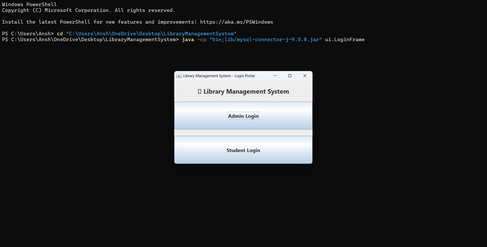
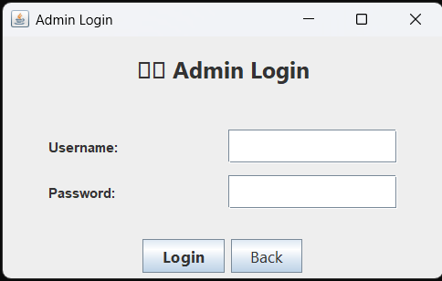
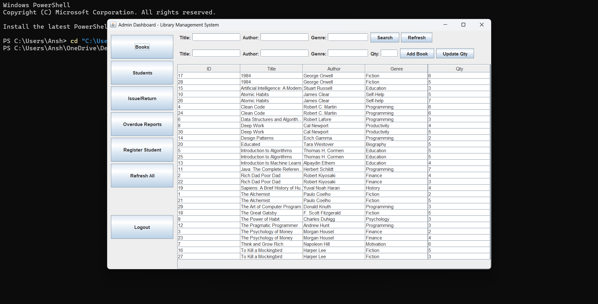
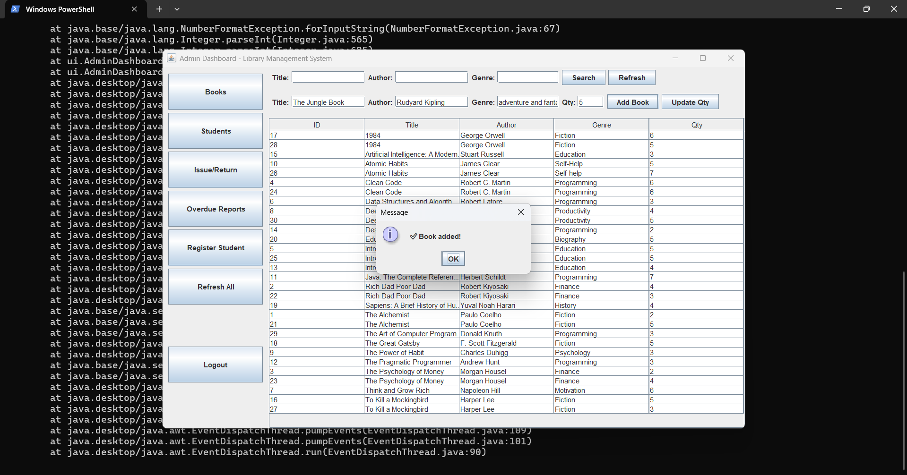
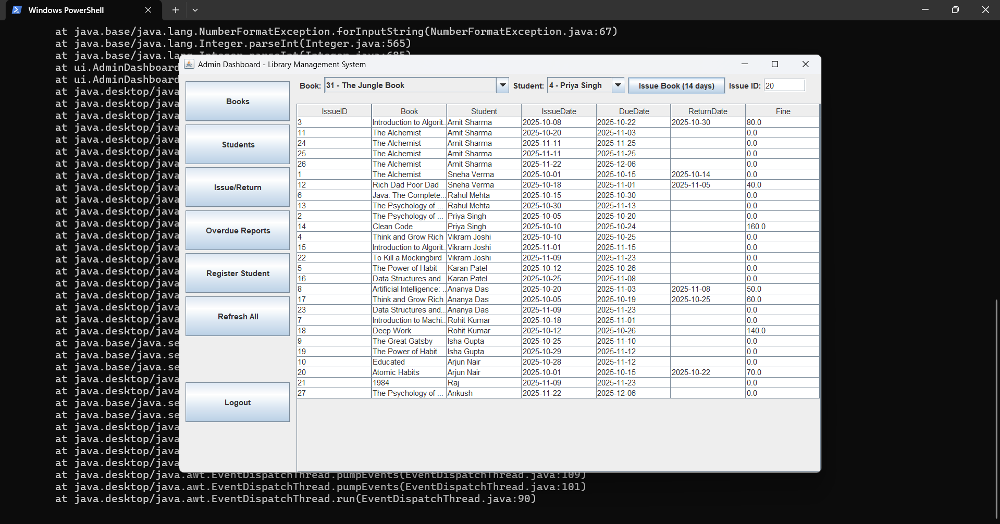
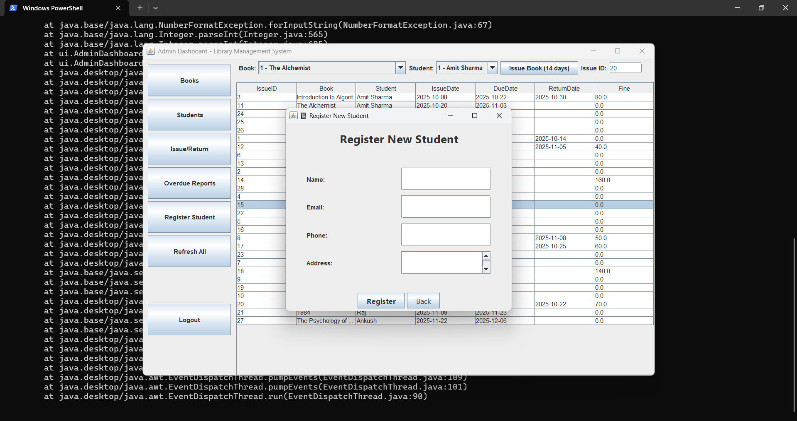
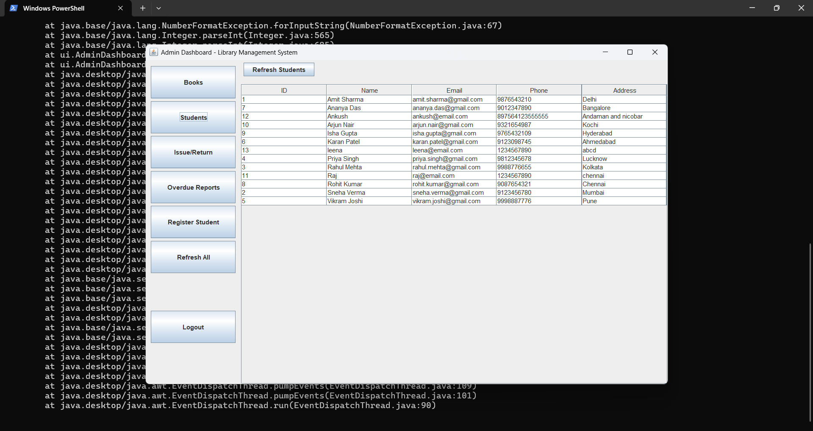
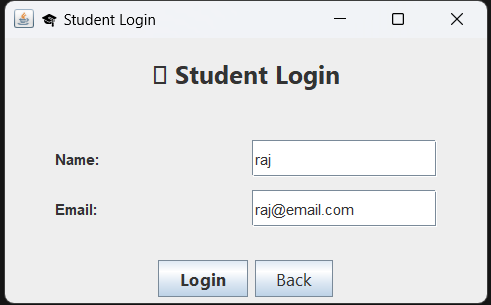

# Library Management System (Java Swing)

**A Java Swing based Library Management System** with admin & student login, book management, issue/return, and search features.

## Overview
This project provides a desktop GUI (Swing) for managing books and student accounts.  
There are two user roles:
- **Admin** — can register students, add/edit/delete books, issue/return books and view all issued records.
- **Student** — can log in to view/search available books and see their issued books.

## Features
- Admin & Student login system  
- Register/manage students  
- Add / Edit / Delete books   
- Search books by **Title**, **Author**, **Genre**  
- Issue books to students  
- Return books & update availability  
- View issued books list with **issue date** & **due date** (fine/overdue can be added)  
- Logout functionality

## Technologies
- Java (JDK 8+)
- Swing (GUI)
- JDBC + MySQL (or any relational DB)
- IDE: NetBeans / IntelliJ IDEA / Eclipse

## Project Structure (recommended)
```
Library-Management-System/
├── src/                 # Java source files
│   ├── dao/             # Data access logic
│   ├── db/              # Database connection
│   ├── models/          # POJO classes
│   ├── ui/              # Swing forms & UI
│   ├── utils/           # Helper utilities
│   └── Main.java        # Entry point
│
├── resources/           # App icons / screenshots (optional)
│
├── sql/                 # Database schema files (optional)
│   └── database.sql
│
├── lib/                 # External JAR dependencies (e.g., mysql-connector)
│
```
##  Screenshots

### Login


### Admin Login


### Admin Dashboard


### Add Books


### Issue & Return Books


### Register New Students


### Student Dashboard


### Student Login


├── README.md            # Documentation
└── .gitignore           # Ignore build & temp files
```

